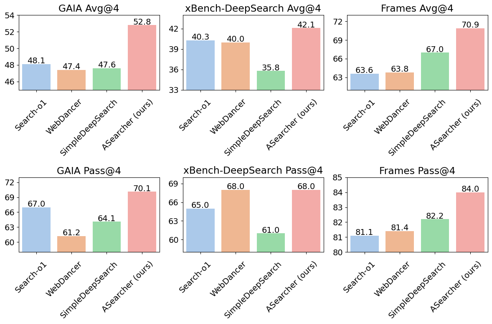
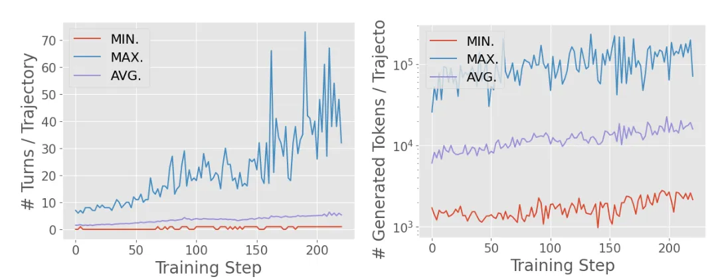

<h1 align="center">
<em>Asearcher</em>: An Open-Source Large-Scale
Reinforcement Learning Project for Search Agents
</h1>

<p align="center">| <a href="assets/ASearcher.pdf"><b>Paper</b></a> | <a href="https://huggingface.co/datasets/inclusionAI/ASearcher-train-data"><b>🤗 Datasets</b></a> | <a href="https://huggingface.co/collections/inclusionAI/asearcher-6891d8acad5ebc3a1e1fb2d1"><b>🤗 Models</b></a> | </p>

ASearcher is an open-source framework designed for large-scale online reinforcement learning (RL) training of search agents. Our mission is to advance Search Intelligence to expert-level performance. We are fully committed to open-source by releasing model weights, detailed training methodologies, and data construction pipelines. Additionally, we provide comprehensive guidance on building and training customized agents based on AReaL. ASearcher empowers developers to build their own high-performance search agents easily and cost-effectively.

**ASearcher Highlights**

+ 🔁 **Data Synthesis Agent**: We introduce a prompt-based LLM agent that autonomously generates grounded, challenging, and highly uncertain QA pairs to enhance training diversity.
+ ⚡ **Fully Asynchronous Agentic RL**: Our scalable agentic RL framework decouples trajectory collection from model training, eliminating GPU idle time and enabling efficient long-horizon RL training.
+ 🌐 **Emergent Long-Horizon Search**: ASearcher exhibits long-horizon search, with tool calls exceeding 40 rounds and generated tokens surpassing 150k during RL training. 
+ 🏆 **Cutting-Edge Performance**: With a simple agent design, ASearcher achieves *Avg@4 scores of 52.8, 42.1, and 70.9* on GAIA, xBench-DeepSearch, and Frames, respectively, surpassing other open-source search agents. ASearcher achieves *Pass@4 scores of 70.1, 68.0, and 84.0* on GAIA, xBench-DeepSearch, and Frames.
+ 📈 **Substantial Improvement Through RL**: RL training  brings improvements of *+9.1, +13.4, and +12.0* on GAIA, xBench-DeepSearch, and Frames, respectively.
+ 🛠️ **Fully Open-Source**: We are committed to open-sourcing all components for agentic RL training, including datasets, data synthesis agent, training details, model weights, and detailed guidelines for customized agent development.<font style="color:#DF2A3F;"> The released models and data could be found at [🤗Huggingface](https://huggingface.co/collections/inclusionAI/asearcher-6891d8acad5ebc3a1e1fb2d1) </font>.


# Results Showcase
We evaluate our approach on challenging QA benchmarks (GAIA, xBench-DeepSearch, and Frames), which test advanced problem-solving abilities and web search strategies. These benchmarks are specifically designed to assess an agent's capability to interact with the real web and retrieve up-to-date information, often beyond the internal knowledge of LLMs.

Our agent, [ASearcher-Web-QwQ](https://huggingface.co/inclusionAI/ASearcher-Web-QwQ), achieves state-of-the-art performance among open-source agents, with the highest Avg@4 scores on GAIA and xBench. Additionally, we report Pass@4, which measures the ratio of questions where the agent finds the correct answer within four trials. [ASearcher-Web-QwQ](https://huggingface.co/inclusionAI/ASearcher-Web-QwQ) also outperforms existing open-source agents in terms of pass rate, further demonstrating its robustness.



 <div style="text-align:center"> Fig.1 The performance of various methods based on 32B-scale models on GAIA, xBench-DeepSearch, and frames. Avg@4 and Pass@4 are reported </div>


When comparing performance before and after reinforcement learning (RL), [ASearcher-Web-QwQ](https://huggingface.co/inclusionAI/ASearcher-Web-QwQ) achieves improvements of +9.1, +13.4, and +12.0 on GAIA, xBench-DeepSearch, and Frames, respectively. In terms of pass rate (Pass@4), [ASearcher-Web-QwQ](https://huggingface.co/inclusionAI/ASearcher-Web-QwQ) also demonstrates significant gains—particularly on xBench-DeepSearch, where it shows a remarkable improvement of 17.0.


 <div style="text-align:center"> Fig.2 Comparison of the performance of QwQ-32B agent before and after RL Training. </div>


# Data Synthesis
We develop a prompt-based LLM agent designed to autonomously generate grounded, challenging, and highly uncertain QA pairs. The process begins with basic questions, which the agent then iteratively refines through two key strategies:

+ Fuzzing: Increasing uncertainty by obscuring key details in the query.
+ Context Injection: Augmenting questions with external facts retrieved via tools to deepen complexity.

Each generated question undergoes rigorous multi-stage validation:

+ Quality Assurance: Checks for fluency, timeliness, and logical coherence.
+ Difficulty Verification: Compares answers generated by an LRM against ground truth to ensure challenge.
+ Answer Uniqueness Validation: Confirms that incorrect LRM answers are indeed invalid, preserving question integrity.


 <div style="text-align:center"> Fig.3 Data Synthesis Agent. </div>

# Fully Asynchronous Agentic RL training

Our analysis reveals significant **variance in the execution time of agent trajectories**. By examining the number of turns and generated tokens during RL training, we observe that lengthy trajectories can require dozens more turns than shorter ones. In terms of token generation, longer trajectories exceed their shorter counterparts by up to two orders of magnitude, as illustrated in the figure below.



 <div style="text-align:center"> Fig.4 (Left) Number of turns versus training steps. (Right) Number of generated tokens versus training steps. </div>

$$
\\
$$
 
**Fuly Asynchronous RL Training Enables Long-Horizon Tool Use.** In batch-generation RL systems, a batch must wait for the longest trajectory to complete, resulting in significant GPU idle time. In contrast, fully asynchronous reinforcement learning (RL) eliminates this bottleneck by completely decoupling training from trajectory generation. This allows relaxed turn limits (e.g., 128 turns/trajectory), enabling agents to explore deeper search paths without sacrificing training efficiency. Remarkably, our agent, ASearcher-Web-QwQ, achieves extreme long-horizon search, **with tool calls exceeding 40 turns and generated tokens surpassing 150k during RL training.


 <div style="text-align:center"> Fig.5 Illustration of full fully asynchronous RL Training. </div>

# Quick Start
## Evaluation
To reproduce the results presented in Fig.2, please run the following script.

```bash
cd evaluation/

MODEL_PATH=/path/to/models 
DATA_DIR=/path/to/test_set # Could be downloaded from [https://huggingface.co/datasets/inclusionAI/ASearcher-test-data]

DATA_NAMES=GAIA,xbench-deepsearch,Frames
AGENT_TYPE=asearcher-reasoning
PROMPT_TYPE=asearcher-reasoning
SEARCH_CLIENT_TYPE=async-web-search-access

SCRIPT_DIR="$(cd "$(dirname "${BASH_SOURCE[0]}")" &> /dev/null && pwd)"
PROJECT_ROOT="$(dirname "$SCRIPT_DIR")"

PYTHONPATH="${PROJECT_ROOT}:$PYTHONPATH" \
SERPER_API_KEY=${your_serper_api_key} \
JINA_API_KEY=${your_jina_api_key} \
TOKENIZERS_PARALLELISM=false \
python3 search_eval_async.py \
    --data_names ${DATA_NAMES} \
    --model_name_or_path ${MODEL_PATH}  \
    --output_dir ${MODEL_PATH} \
    --data_dir ${DATA_DIR} \
    --prompt_type $PROMPT_TYPE \
    --agent-type ${AGENT_TYPE} \
    --search-client-type ${SEARCH_CLIENT_TYPE} \
    --tensor_parallel_size 4 \
    --temperature 0.6 \
    --parallel-mode seed \
    --seed 1 \
    --use-jina \
    --llm_as_judge \
    --pass-at-k 1 \ # if you want get more stable result, please increase it
```
please also refer to the [Evaluation doc](docs/evaluation.md) for the detailed guideline.

## Training


### Fine-tuning a 7B model

**1. Set Up the Environment**

Please refer to https://inclusionai.github.io/AReaL/tutorial/installation.html#runtime-environment

**2.1 Training a 7B model on 16 nodes (recommanded)**
```bash
cd AReaL

export SERPER_API_KEY=YOUR_SERPER_API_KEY
export JINA_API_KEY=YOUR_JINA_API_KEY
python3 -m areal.launcher.ray ASearcher/train/asearcher.py \
    --config ASearcher/configs/asearcher_web_16nodes.yaml \
    experiment_name=<your experiment name> \
    trial_name=<your trial name> \
    allocation_mode=sglang.d96p1t1+d32p1t1 \
    cluster.n_nodes=16 \
    cluster.n_gpus_per_node=8
```

**2.2 Training a 7B model on a single node (might be slow)**

```bash
cd AReaL

export SERPER_API_KEY=YOUR_SERPER_API_KEY
export JINA_API_KEY=YOUR_JINA_API_KEY

python3 -m areal.launcher.local ASearcher/train/asearcher.py \
    --config ASearcher/configs/asearcher_web.yaml \
    experiment_name=<your experiment name> \
    trial_name=<your trial name>
```

### Fine-tuning a QwQ-32B Agent
    Coming soon!! Please stay tuned!!

please also refer to the [Training doc](docs/training.md) for the detailed guideline.


## (Optional) Customization

Please refer to our [guideline](docs/guideline.md) for more information about building a custom agent.

## (Optional) Data Synthesis
The data synthesis agent is provided in `qa_synthesis/qa_synthesis_agent.py`. To run the agent for synthesizing QA, you need to,

1. Download related data, including the Wikipedia 2018 webpages, and a list of sampled links
2. Launch SGLang servers for two models: `QwQ-32B` and `Qwen2.5-72B-instruct`
3. Run `python3 qa_synthesis/qa_synthesis_agent.py` to synthesize high-quality QAs!

## Acknowledgements

We would like to acknowledge that the primary contributors to this work are from the RL Lab at Ant Research and the Institute for Interdisciplinary Information Sciences at Tsinghua University.

Our team has also received invaluable assistance from the following groups:

- The [AWorld](https://github.com/inclusionAI/AWorld) team at Ant Group for sharing their experience in agent development
- The Super Computing Technology (SCT) team at Ant Group, particularly for their specialized knowledge in large-scale cluster management and operations

We are also grateful for the foundational work and inspiration provided by the research community, including but not limited to [Search-o1](https://search-o1.github.io/), [Search-R1](https://github.com/PeterGriffinJin/Search-R1) and [WebAgent](https://github.com/Alibaba-NLP/WebAgent).
